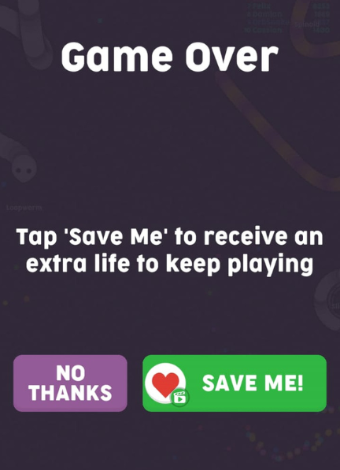
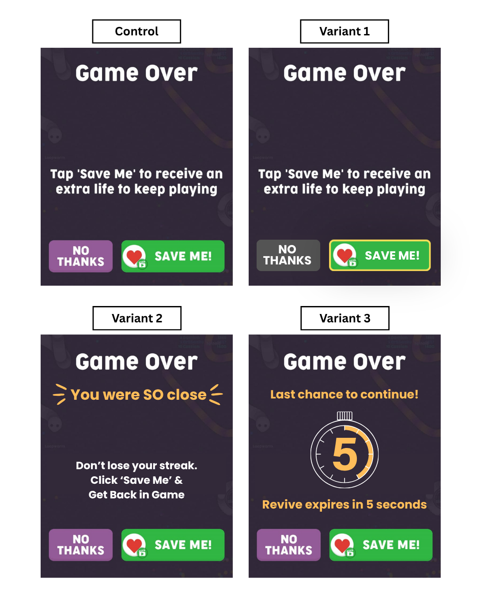

# Optimizing Player Revival Decisions

### A Behavioral A/B Testing Case Study in Casual Gaming

A behavioral A/B testing case study focused on optimizing revive-screen strategies in casual mobile games to improve meaningful gameplay continuation, revival acceptance, and overall player engagement.

---

  

# Project Overview

This project is based on an experimentation scenario for the casual gaming company **“Offline Games – No Wifi Games”**. The company was experiencing a decline in revival acceptance rates and meaningful gameplay continuation after players reached the “Game Over” screen.

After analyzing the existing revive flow, it was observed that the current revive screen lacked strong visual hierarchy and behavioral guidance, making players more likely to abandon the session instead of continuing gameplay.

To address this problem, the company decided to conduct a multivariate A/B testing experiment by redesigning the revive screen.

The objective of the experiment was to identify which revive-screen strategy could improve meaningful post-revival gameplay engagement while maintaining a healthy player experience.

---

# Problem Statement

“Offline Games – No Wifi Games” was experiencing a decline in player revival acceptance rates and meaningful gameplay continuation after players reached the “Game Over” screen.

Although the game offered players an opportunity to continue gameplay through the “Save Me” option, a large portion of players were abandoning the session instead of reviving. This directly impacted:

* overall gameplay engagement,
* session continuation,
* and potential monetization opportunities through rewarded ads.

After reviewing the existing revive screen, several UX and behavioral issues were identified:

* lack of clear visual hierarchy,
* weak attention guidance toward the primary CTA,
* absence of emotional motivation,
* and no urgency or behavioral trigger encouraging continuation.

  

As a result, players were more likely to exit the session immediately after failure rather than continue playing.

To address this problem, the company decided to conduct a multivariate A/B testing experiment to evaluate whether behavioral design interventions could improve meaningful post-failure engagement and revival decisions.

---

# Goals

The goal of this experiment was to identify which revive-screen design could improve meaningful gameplay continuation after players reached the “Game Over” screen.

The experiment specifically aimed to:

* Increase revival acceptance rate.
* Increase average additional gameplay time per session.
* Compare the impact of:

  * visual hierarchy,
  * emotional framing,
  * and urgency-based messaging on player behavior.
* Identify whether higher revive clicks lead to meaningful engagement continuation.

The experiment also aimed to determine which variant created the best balance between:

* revive acceptance,
* gameplay continuation,
* and player experience.

---

# Methodology

## 1. Experiment Concept

The current revive screen used by “Offline Games – No Wifi Games” lacked strong visual hierarchy and behavioral guidance, causing players to abandon the session instead of continuing gameplay.

The hypothesis was that redesigning the revive screen using behavioral interventions such as visual hierarchy optimization, emotional framing, and urgency-based messaging could improve revival acceptance and increase meaningful gameplay continuation after players reached the “Game Over” screen.

---

## 2. Experiment Variants

| Variant   | Description                   |
| --------- | ----------------------------- |
| Control   | Existing revive screen        |
| Variant 1 | Visual hierarchy optimization |
| Variant 2 | Emotional framing             |
| Variant 3 | Urgency-based messaging       |

Each variant was designed to test a single behavioral intervention independently.

---

## 3. Success Metrics

| Metric Type       | Metric                                       |
| ----------------- | -------------------------------------------- |
| North Star Metric | Average Additional Gameplay Time Per Session |
| Primary Metric    | Revival Acceptance Rate                      |

---

## 4. Sample Size & Power Analysis

The experiment was conducted using a synthetic session-level dataset containing approximately **30,092 gameplay sessions** distributed across four experimental groups.

Power analysis was performed before hypothesis testing to ensure that the sample size was sufficient to detect meaningful behavioral differences between variants with statistical reliability.

---

## 5. Statistical Methodology

The following statistical techniques were used during the analysis:

### Chi-Square Test

Used to evaluate differences in revival acceptance rate across variants.

### Kruskal-Wallis Test

Used to compare gameplay continuation distributions across multiple variants since gameplay data was non-normally distributed.

### Dunn’s Post-Hoc Test

Used to identify which specific variants differed significantly after Kruskal-Wallis testing.

---

# Analysis

The complete experimentation workflow, statistical testing, and behavioral analysis can be explored in the Jupyter Notebook below:

➡️ [View Full Analysis Notebook](./analysis.ipynb)

---

# Key Findings

## 1. North Star Metric — Average Additional Gameplay Time Per Session

Variant 2 (Emotional Framing) generated the strongest gameplay continuation across all experimental groups with an average of **1.95 additional gameplay minutes per session**, significantly outperforming:

* Control (**0.49 minutes**),
* Variant 1 (**0.94 minutes**),
* and Variant 3 (**1.18 minutes**).

When analyzing only players who accepted revival:

* Variant 2 users continued gameplay for an average of **5.09 minutes** after revival,
  compared to:
* Control (**2.12 minutes**),
* Variant 1 (**2.98 minutes**),
* and Variant 3 (**2.70 minutes**).

These findings indicated that emotional framing generated the healthiest and most meaningful gameplay continuation behavior among all revive-screen strategies.

---

## 2. Primary Metric — Revival Acceptance Rate

Variant 3 (Urgency-Based Messaging) produced the highest revival acceptance rate at **43.81%**, demonstrating that urgency and scarcity mechanics were highly effective at driving immediate player actions.

Revival acceptance rates across variants were:

* Control → **23.30%**
* Variant 1 → **31.60%**
* Variant 2 → **38.28%**
* Variant 3 → **43.81%**

Variant 1 also showed a meaningful improvement over the Control group, suggesting that stronger visual hierarchy and CTA visibility positively influenced revive decisions.

---

## 3. Overall Findings

The experiment demonstrated that the variant generating the highest immediate revive conversion was not necessarily the variant producing the healthiest gameplay continuation behavior.

Although Variant 3 generated the highest revive clicks, Variant 2 produced significantly stronger gameplay continuation and healthier engagement quality overall.

Statistical testing confirmed that the observed differences between variants were statistically significant:

* Chi-Square Test showed significant differences in revival acceptance behavior across variants
  (**χ² = 781.41, p < 0.001**).
* Kruskal-Wallis Test confirmed significant differences in gameplay continuation distributions
  (**H = 1348.65, p < 0.001**).
* Dunn’s Post-Hoc Test identified statistically significant pairwise differences between all experimental groups.

(Distribution analysis also revealed that gameplay continuation data was highly skewed and zero-inflated. As a result, non-parametric statistical methods were used instead of traditional ANOVA testing.)

Overall, the findings suggested that emotionally-driven behavioral interventions produced stronger sustainable engagement outcomes compared to aggressive urgency-based interactions.

---

# Final Recommendation

Based on the experimental findings, **Variant 2 (Emotional Framing)** is recommended as the optimal revive-screen strategy for rollout.

Although Variant 3 generated the highest revival acceptance rate **(43.81%)**, Variant 2 produced the strongest meaningful gameplay continuation with an average of **1.95** additional gameplay minutes per session, significantly outperforming all other variants.

The analysis demonstrated that emotionally-driven behavioral interventions created healthier and more sustainable engagement behavior compared to urgency-based messaging, which primarily optimized short-term revive conversions.

Therefore, the recommended product strategy is to prioritize revive-screen experiences that maximize meaningful player engagement rather than focusing only on immediate revive clicks.
